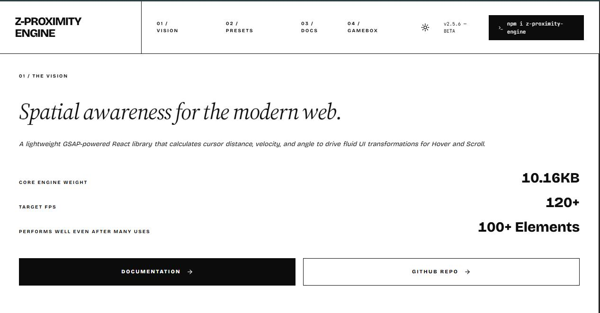

<div align="center">
  

  # 🚀 ZProximity Engine
  **The Physics of Attraction for the Modern Web.**
  
  [](https://www.npmjs.com/package/z-proximity-engine)
  [](https://www.npmjs.com/package/z-proximity-engine)
  [](https://bundlephobia.com/package/z-proximity-engine)
  [](#license)

  `ZProximity` is a high-performance React motion engine designed to bridge the gap between complex mathematical physics and organic UI design. Create reactive, buttery-smooth interactions that respond to user proximity (Pointer & Scroll) with a single declarative prop.

  [**✨ View Live Playground**](https://z-proximity-engine.vercel.app/) • [**📦 NPM Package**](https://www.npmjs.com/package/z-proximity-engine) • [**💡 GitHub**](https://github.com/YoussefZidan-1/ZProximityEngine)
</div>

---

## 🤯 The Magic (Why use this?)

Most proximity effects require manual event listeners, complex trigonometry, and cause heavy layout thrashing that kills performance. **ZProximity** abstracts all of that into a performance-first architecture:

- 🏎️ **120+ FPS Engine:** Uses GSAP's `quickTo`/`quickSetter` to bypass React's render cycle entirely.
- 🗑️ **Zero Garbage Collection Stutters:** Uses pre-allocated memory pools and batched layout reads to prevent layout thrashing.
- 👁️ **Smart Off-Screen Culling:** Built-in `IntersectionObserver` automatically sleeps animations when elements leave the viewport.
- 🧲 **Exponential Decay:** Uses advanced mathematics (not linear distance) for a truly organic, "magnetic" feel.
- 🎭 **String-Based Presets:** Chain massive physics calculations instantly (e.g., `preset="scale-blur-rotate"`).

---

## 📦 Installation

```bash
npm install z-proximity-engine gsap @gsap/react
```

---

## ⚡ Quick Start: 3 Lines to Magic

### 1. The "Cipher" Scramble (Hover)
Transform static text into reactive, hacker-style deciphering text simply by moving your mouse near it.

```tsx
import { ProximityText } from 'z-proximity-engine';

export const SecretText = () => (
  <ProximityText 
    text="TOP SECRET DATA"
    preset="cipher-scale-opacity" // Chains 3 effects automatically!
    config={{ reach: 1.5, ease: "sharp" }}
  />
);
```

### 2. The "Interactive Dock" (Physics)
Apply magnetic pull to the item you hover, and push neighboring items away to create space.

```tsx
import { Proximity } from 'z-proximity-engine';

export const AppleDock = () => (
  <Proximity 
    selector=".dock-item" 
    nearestPreset="magnetic-scale" // Pulls and scales closest item
    neighborPreset="repel"         // Pushes away the surrounding items
    config={{ reach: 2, scale: [1, 1.5] }}
  >
    <div className="dock-item">🚀</div>
    <div className="dock-item">✨</div>
    <div className="dock-item">🔥</div>
  </Proximity>
);
```

### 3. The "Staggered Reveal" (Scroll)
ZProximity isn't just for mice. Use `mode="scroll"` to trigger incredibly complex, staggered reveals tied to the user's scrollbar.

```tsx
export const FeatureList = () => (
  <Proximity
    mode="scroll"
    selector=".feature"
    preset="reveal-opacity"
    config={{
      scroll: { start: "top 90%", once: true },
      stagger: 0.2 // Staggers the reveal perfectly
    }}
  >
    <div className="feature">Feature 1</div>
    <div className="feature">Feature 2</div>
  </Proximity>
);
```

---

## 🛠️ The Preset Arsenal

Combine any of these instantly using dash-syntax (e.g., `magnetic-blur-tilt`).

| Category | Preset | What it does |
| :--- | :--- | :--- |
| **Transform** | `scale`, `x`, `y`, `rotate`, `skew` | Standard hardware-accelerated 2D transforms. |
| **Smart Layout** | `flexScale` | Scales items *without* layout jumps by perfectly calculating margin offsets. |
| **Appearance** | `opacity`, `blur`, `reveal` | Smooth visibility, depth-of-field masking, and inset clip-path reveals. |
| **Physics** | `magnetic`, `repel` | Elements pull strictly toward the pointer origin, or actively dodge it. |
| **3D Space** | `tilt`, `tiltCard` | Realistic 3D rotation based on pointer coordinate offsets relative to center. |
| **Typography** | `weight`, `cipher` | Modulates Variable Font `wght` axes, or scrambles text into random glyphs. |

---

## 🎛️ Feature Spotlight (Everything it can do)

### 🎯 Split Focus Logic
The engine distinguishes between exact targets and neighbors:
- `preset`: Applies to all elements within reach.
- `nearestPreset`: Overrides and applies **only** to the element closest to the cursor.
- `neighborPreset`: Applies **only** to elements surrounding the hovered target.

### ⏱️ Micro-Timing (Timelines)
You don't have to share one duration. Give every property its own timeline for high-end, staggered choreography.
```tsx
config={{
  timeline: {
    blur: { duration: 0.1 },                // Instant clear
    scale: { duration: 0.8, ease: "bouncy" }, // Rubbery bounce
    rotate: { delay: 0.1, duration: 1.5 }    // Trailing spin effect
  }
}}
```

### 🔡 Intelligent Text Splitting
`ProximityText` handles the nightmare of typography animation automatically:
- **`splitBy`**: `"letter"`, `"word"`, or `"line"`.
- **`ignoreText`**: Pass strings or Regex (e.g., `["&", /@/ ]`) to skip animating specific characters.
- **`clipFix`**: Adds invisible padding to prevent letters from being clipped during scale/bounce eases.

### 🛡️ Movement Constraints
- **`lockAxis`**: Lock physics to `"x"`, `"y"`, `"both"`, or `"none"`. (Great for horizontal-only magnetic sliders).
- **`maxTravel`**: Clamp the maximum pixels an element can physically be pulled/pushed.
- **`explicit`**: Require the mouse to physically touch the bounding box before physics activate.

### ♿ Accessibility Built-in
- Honors `prefers-reduced-motion` at the OS level instantly.
- **`disableOnMobile: true`** automatically kills heavy physics on touch devices to save battery and layout issues.

---

## 📖 Mini-Documentation (API)

ZProximity is controlled via a single `config` object or direct props. 

### Core Properties

| Prop | Type | Default | Description |
| :--- | :--- | :--- | :--- |
| `mode` | `"pointer" \| "scroll"` | `"pointer"` | Track mouse movement vs viewport scroll position. |
| `reach` | `number` | `2` | Euclidean radius of influence. Higher = farther reach. |
| `falloff` | `number` | `2.4` | Curve smoothness. Higher = steeper drop-off. |
| `duration` | `number` | `0.2` | Animation entry speed. |
| `ease` | `string` | `"power1.out"` | GSAP ease string. Also accepts custom presets (`"bouncy"`, `"fluid"`, `"jello"`). |
| `maxTravel`| `number \| {x, y}` | `Infinity` | Cap the pixels a `magnetic` or `repel` preset can move. |
| `scroll` | `object` | `{}` | Settings for scroll mode (`start`, `end`, `scrub`, `once`, `stagger`). |
| `disableOnMobile`| `boolean \| string[]` | `false` | Pass `true` to disable on phones, or pass specific presets to disable (e.g., `['blur']`). |

### The "Escape Hatch" (Custom Math)
Need custom flocking behaviors, spring dynamics, or color shifting? Use `onCalculate` to inject your own GSAP variables per frame based on the engine's internal intensity math.

```tsx
<Proximity
  reach={1.5}
  onCalculate={(intensity, distance, dx, dy, isNearest) => ({
    scale: 1 + intensity * 0.05,
    filter: `hue-rotate(${intensity * 90}deg)`,
    y: isNearest ? -20 : 0
  })}
>
  <div className="custom-item">Custom Physics</div>
</Proximity>
```

---

## 🤝 Contributing
Built by **Yousef Zedan**. This is an open-source project aimed at pushing the boundaries of what React can do on the presentation layer. 

1. Star the repo ⭐
2. Submit a PR with your creative presets or math optimizations!

## 📄 License
MIT © [Yousef Zedan](https://github.com/YoussefZidan-1/ZProximityEngine)
